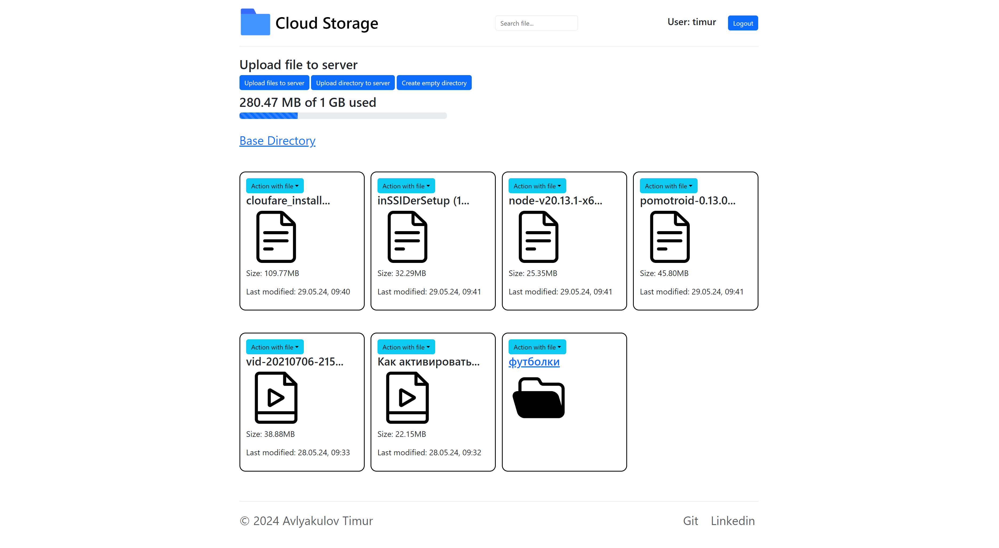
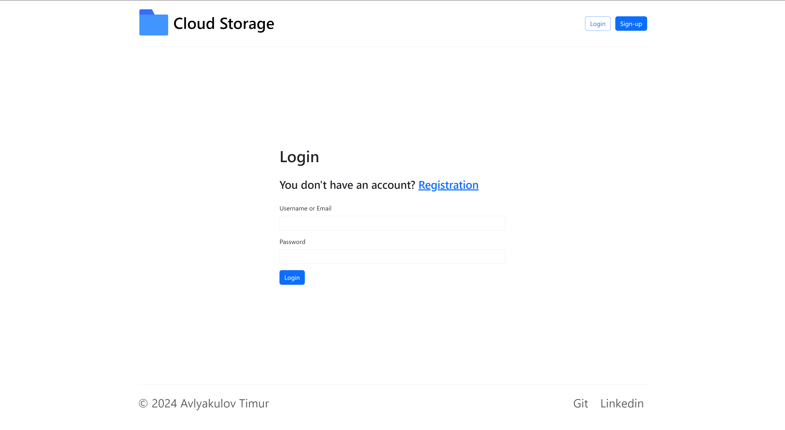
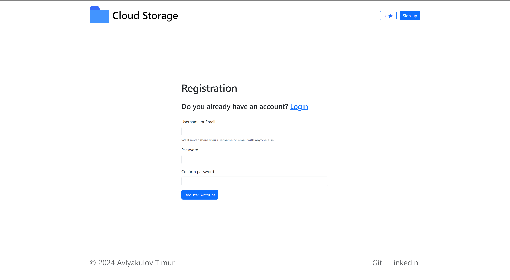
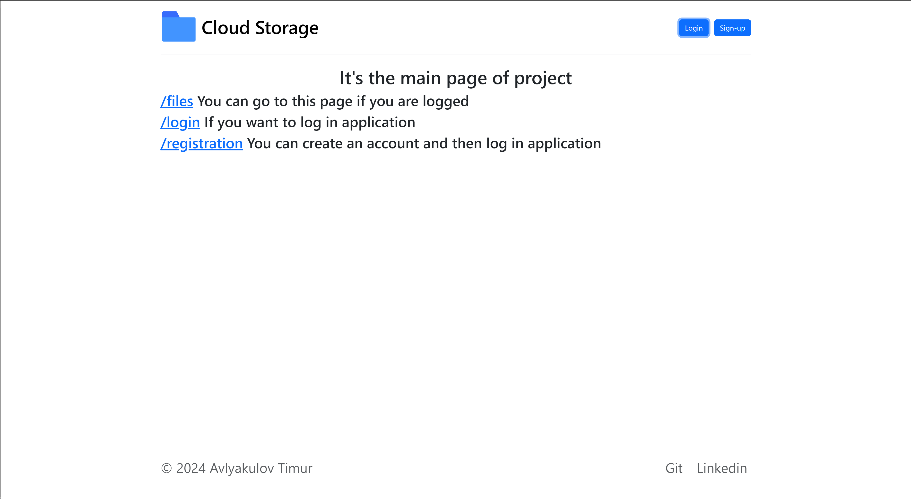
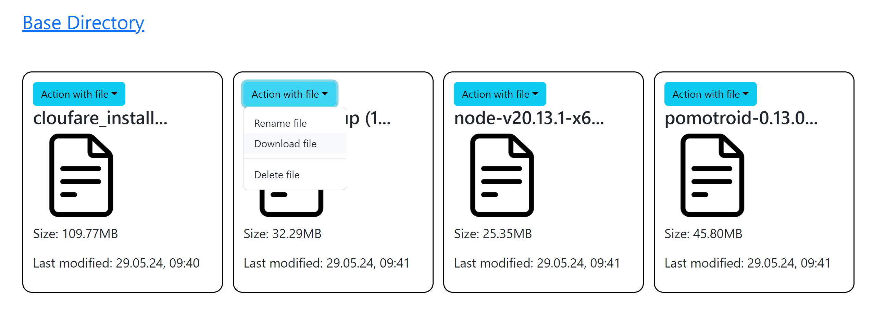
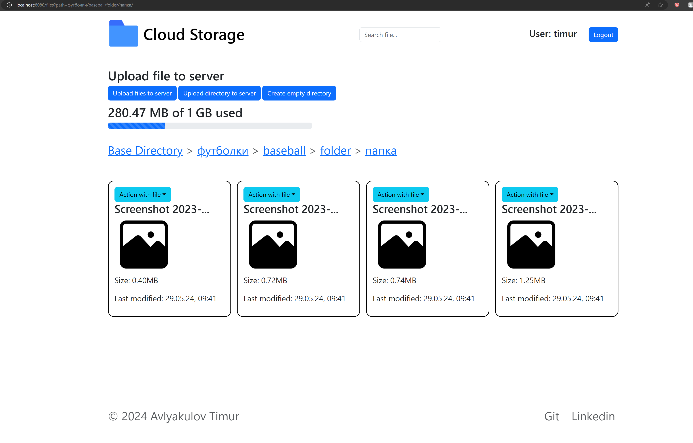
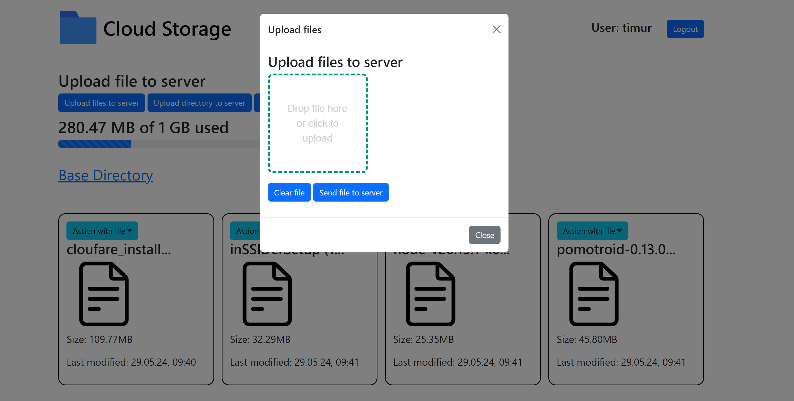
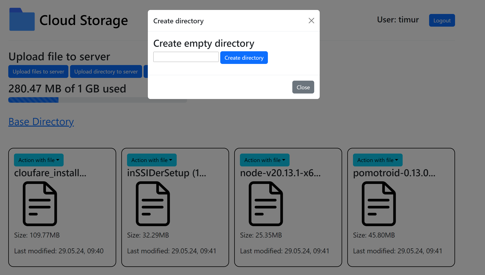

# Cloud File Storage

## Description

`Cloud File Storage` - It is Spring Boot App with using for testing - testcontainers.
It has a view with thymeleaf pages you can check storage any data and create account for saving you files in AWS S3.
I am using MINIO - AWS S3 compatible storage. 
It has login and registration system. Also, it has a login and registration validation it means you can't create an account with
invalid fields or with empty fields, you can't create an easy password, and you can't create account with same login which
was created before. This app has a session system, it was implemented by spring session using Redis that controls pages that user can visit. If you aren't logged you can't save locations.
and you can't visit pages /files
As well I added liquibase for migrations, easy way to create tables and add some data.
At frontend, I used html/css js and modal windows. You can see when I upload file to server.

This app has Dockerfile and docker compose too.

## Actions you can do with file/directory
* Upload to server
* Download from server
* Rename
* Delete
* Create empty directory

<!-- Project from this [course](https://zhukovsd.github.io/java-backend-learning-course/) -->

## Project Stack

* Java
* AWS S3 Minio
* Spring Boot
* Spring Security
* Spring Data JPA
* Redis
* MySQL
* Session Management
* Docker
* Docker compose
* Liquibase
* Logging
* TestContainers, Integration tests
* Thymeleaf, HTML, CSS, JS

## Pages of project

### Logged Page

### Login Page

### SignUp Page

### Main Page

### Actions with files

### BreadCrumb

### Uploading files to server

### Creating empty directory

